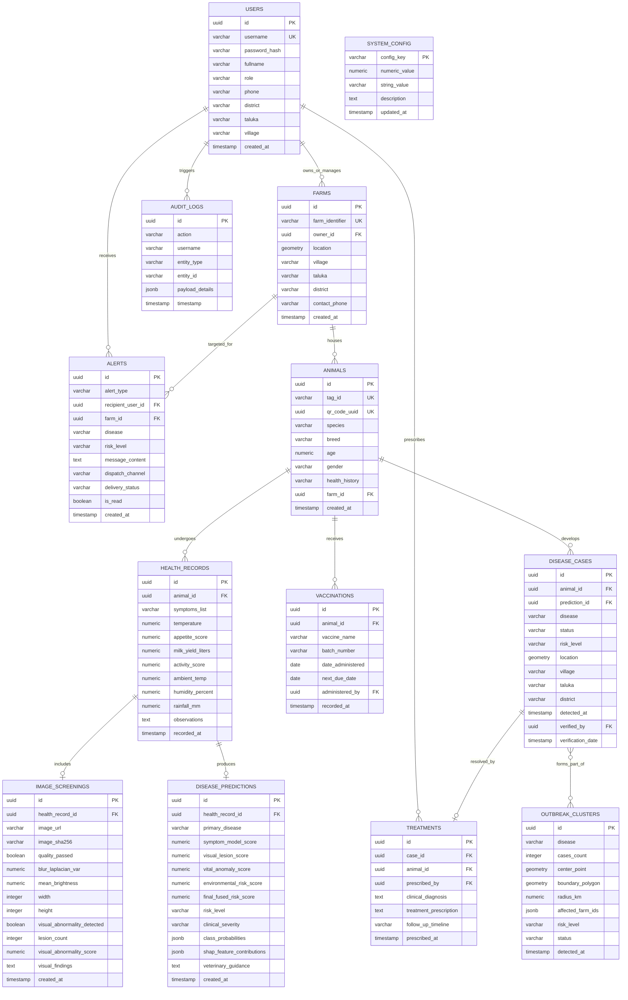

# Database Design: AI-Livestock Health Sentinel

**Database Engine:** PostgreSQL 16 with PostGIS 3.4 Spatial Extension  
**Coordinate Reference System:** EPSG:4326 (WGS 84 - Standard Latitude / Longitude)  
**Schema Version:** 2.0 (SIH 2026 Final Prototype)  
**Date:** September 2026  

---

## 1. Database Architecture & Technology Rationale

The **AI-Livestock Health Sentinel** requires a robust relational data model combined with advanced geospatial computing capabilities:

1. **Relational Integrity**: Strict foreign key constraints and transactional consistency across animal records, health assessments, veterinary verifications, and clinical prescriptions.
2. **PostGIS Spatial Engine**: Native spatial geometry types (`GEOMETRY(Point, 4326)`, `GEOMETRY(Polygon, 4326)`) and GIST indexing enable sub-millisecond geofencing, buffer zone calculations, and spatial cluster detection across thousands of farms.
3. **JSONB Semi-Structured Storage**: Efficiently stores multi-class model probability vectors and Explainable AI (SHAP) feature attribution payloads without schema bloat.
4. **Dual-Mode Fallback Compatibility**: For laptop evaluations or environments without a live PostgreSQL service, the database abstraction layer (`database.py`) provides an automatic fallback to the local JSON sandbox engine (`backend/data/db.json`).

---

## 2. Entity-Relationship (ER) Diagram



---

## 3. Detailed Table Schemas (DDL Specifications)

### 1. `users`
Manages identity and access credentials for all platform actors.
```sql
CREATE TABLE users (
    id UUID PRIMARY KEY DEFAULT gen_random_uuid(),
    username VARCHAR(50) UNIQUE NOT NULL,
    password_hash VARCHAR(255) NOT NULL,
    fullname VARCHAR(100) NOT NULL,
    role VARCHAR(20) NOT NULL CHECK (role IN ('FARMER', 'VETERINARIAN', 'OFFICER', 'ADMIN')),
    phone VARCHAR(20),
    district VARCHAR(50),
    taluka VARCHAR(50),
    village VARCHAR(50),
    is_active BOOLEAN DEFAULT TRUE,
    created_at TIMESTAMP WITH TIME ZONE DEFAULT CURRENT_TIMESTAMP
);

CREATE INDEX idx_users_username ON users(username);
CREATE INDEX idx_users_role ON users(role);
```

### 2. `farms`
Represents farm holdings and agricultural properties with geocoded spatial location.
```sql
CREATE TABLE farms (
    id UUID PRIMARY KEY DEFAULT gen_random_uuid(),
    farm_identifier VARCHAR(50) UNIQUE NOT NULL, -- e.g., 'MH-PUN-HAV-0012'
    owner_id UUID REFERENCES users(id) ON DELETE SET NULL,
    location GEOMETRY(Point, 4326) NOT NULL,
    village VARCHAR(50) NOT NULL,
    taluka VARCHAR(50) NOT NULL,
    district VARCHAR(50) NOT NULL,
    contact_phone VARCHAR(20),
    created_at TIMESTAMP WITH TIME ZONE DEFAULT CURRENT_TIMESTAMP
);

-- PostGIS GIST Spatial Index for rapid distance and geofence queries
CREATE INDEX idx_farms_location ON farms USING GIST(location);
CREATE INDEX idx_farms_region ON farms(district, taluka, village);
```

### 3. `animals`
Cattle inventory records, demographics, and unique QR code identifiers.
```sql
CREATE TABLE animals (
    id UUID PRIMARY KEY DEFAULT gen_random_uuid(),
    tag_id VARCHAR(50) UNIQUE NOT NULL, -- Ear-tag barcode / RFID
    qr_code_uuid UUID UNIQUE DEFAULT gen_random_uuid(), -- Used for quick mobile scanning
    species VARCHAR(30) DEFAULT 'Cattle' NOT NULL,
    breed VARCHAR(50) NOT NULL, -- e.g., 'Gir', 'Sahiwal', 'Holstein Friesian'
    age NUMERIC(4, 1) NOT NULL, -- Age in years (e.g. 3.5)
    gender VARCHAR(10) NOT NULL CHECK (gender IN ('Female', 'Male')),
    health_history VARCHAR(50) DEFAULT 'None', -- 'None', 'Previous Illness', 'Chronic'
    farm_id UUID REFERENCES farms(id) ON DELETE CASCADE,
    created_at TIMESTAMP WITH TIME ZONE DEFAULT CURRENT_TIMESTAMP
);

CREATE INDEX idx_animals_tag_id ON animals(tag_id);
CREATE INDEX idx_animals_qr_uuid ON animals(qr_code_uuid);
CREATE INDEX idx_animals_farm_id ON animals(farm_id);
```

### 4. `health_records`
Clinical vitals, symptom checklists, and environmental telemetry for each assessment event.
```sql
CREATE TABLE health_records (
    id UUID PRIMARY KEY DEFAULT gen_random_uuid(),
    animal_id UUID NOT NULL REFERENCES animals(id) ON DELETE CASCADE,
    symptoms_list TEXT[] NOT NULL DEFAULT '{}', -- Array of symptom tokens
    temperature NUMERIC(4, 1) NOT NULL, -- Rectal temperature in Celsius
    appetite_score NUMERIC(2, 1) NOT NULL, -- 0.0=None, 1.0=Normal, 2.0=High
    milk_yield_liters NUMERIC(4, 1) NOT NULL DEFAULT 0.0,
    activity_score NUMERIC(2, 1) NOT NULL, -- 0.0=Lethargic/Low, 1.0=Normal, 2.0=High
    ambient_temp NUMERIC(4, 1), -- Environmental temperature in C
    humidity_percent NUMERIC(4, 1), -- Relative humidity %
    rainfall_mm NUMERIC(5, 1) DEFAULT 0.0, -- Recent precipitation
    observations TEXT,
    recorded_at TIMESTAMP WITH TIME ZONE DEFAULT CURRENT_TIMESTAMP
);

CREATE INDEX idx_health_records_animal_id ON health_records(animal_id);
CREATE INDEX idx_health_records_date ON health_records(recorded_at DESC);
```

### 5. `image_screenings`
Image metadata, computer vision quality metrics, and PyTorch lesion screening results.
```sql
CREATE TABLE image_screenings (
    id UUID PRIMARY KEY DEFAULT gen_random_uuid(),
    health_record_id UUID UNIQUE NOT NULL REFERENCES health_records(id) ON DELETE CASCADE,
    image_url VARCHAR(255) NOT NULL,
    image_sha256 VARCHAR(64) NOT NULL,
    quality_passed BOOLEAN NOT NULL DEFAULT TRUE,
    blur_laplacian_var NUMERIC(8, 2), -- Laplacian variance (>50 is sharp)
    mean_brightness NUMERIC(5, 2), -- Intensity (40 to 225)
    width INTEGER,
    height INTEGER,
    visual_abnormality_detected BOOLEAN NOT NULL DEFAULT FALSE,
    lesion_count INTEGER DEFAULT 0,
    visual_abnormality_score NUMERIC(5, 2) DEFAULT 0.0, -- 0.0 to 100.0
    visual_findings TEXT,
    created_at TIMESTAMP WITH TIME ZONE DEFAULT CURRENT_TIMESTAMP
);

CREATE INDEX idx_image_screenings_record ON image_screenings(health_record_id);
```

### 6. `disease_predictions`
Synthesized multi-modal risk scoring outputs, class probabilities, and SHAP explainability drivers.
```sql
CREATE TABLE disease_predictions (
    id UUID PRIMARY KEY DEFAULT gen_random_uuid(),
    health_record_id UUID UNIQUE NOT NULL REFERENCES health_records(id) ON DELETE CASCADE,
    primary_disease VARCHAR(50) NOT NULL,
    symptom_model_score NUMERIC(5, 2) NOT NULL, -- 0.0 to 100.0
    visual_lesion_score NUMERIC(5, 2) DEFAULT 0.0,
    vital_anomaly_score NUMERIC(5, 2) DEFAULT 0.0,
    environmental_risk_score NUMERIC(5, 2) DEFAULT 0.0,
    final_fused_risk_score NUMERIC(5, 2) NOT NULL,
    risk_level VARCHAR(20) NOT NULL CHECK (risk_level IN ('LOW', 'MODERATE', 'HIGH')),
    clinical_severity VARCHAR(20) NOT NULL CHECK (clinical_severity IN ('MILD', 'MODERATE', 'SEVERE')),
    class_probabilities JSONB NOT NULL DEFAULT '{}', -- e.g. {"LSD": 82.5, "FMD": 12.0}
    shap_feature_contributions JSONB NOT NULL DEFAULT '[]', -- Top SHAP drivers
    veterinary_guidance TEXT[] NOT NULL DEFAULT '{}',
    created_at TIMESTAMP WITH TIME ZONE DEFAULT CURRENT_TIMESTAMP
);

CREATE INDEX idx_predictions_record ON disease_predictions(health_record_id);
CREATE INDEX idx_predictions_risk ON disease_predictions(risk_level, final_fused_risk_score);
```

### 7. `disease_cases`
Official disease case logs escalated to the veterinary triage workflow.
```sql
CREATE TABLE disease_cases (
    id UUID PRIMARY KEY DEFAULT gen_random_uuid(),
    animal_id UUID NOT NULL REFERENCES animals(id) ON DELETE CASCADE,
    prediction_id UUID REFERENCES disease_predictions(id) ON DELETE SET NULL,
    disease VARCHAR(50) NOT NULL,
    status VARCHAR(20) NOT NULL DEFAULT 'SUSPECTED' CHECK (status IN ('SUSPECTED', 'VERIFIED', 'REJECTED')),
    risk_level VARCHAR(20) NOT NULL,
    location GEOMETRY(Point, 4326) NOT NULL,
    village VARCHAR(50) NOT NULL,
    taluka VARCHAR(50) NOT NULL,
    district VARCHAR(50) NOT NULL,
    detected_at TIMESTAMP WITH TIME ZONE DEFAULT CURRENT_TIMESTAMP,
    verified_by UUID REFERENCES users(id) ON DELETE SET NULL,
    verification_date TIMESTAMP WITH TIME ZONE
);

CREATE INDEX idx_disease_cases_location ON disease_cases USING GIST(location);
CREATE INDEX idx_disease_cases_status ON disease_cases(status);
CREATE INDEX idx_disease_cases_disease ON disease_cases(disease);
CREATE INDEX idx_disease_cases_date ON disease_cases(detected_at DESC);
```

### 8. `treatments`
Formal veterinary clinical prescriptions, diagnostic confirmations, and follow-up schedules.
```sql
CREATE TABLE treatments (
    id UUID PRIMARY KEY DEFAULT gen_random_uuid(),
    case_id UUID UNIQUE NOT NULL REFERENCES disease_cases(id) ON DELETE CASCADE,
    animal_id UUID NOT NULL REFERENCES animals(id) ON DELETE CASCADE,
    prescribed_by UUID NOT NULL REFERENCES users(id) ON DELETE CASCADE,
    clinical_diagnosis TEXT NOT NULL,
    treatment_prescription TEXT NOT NULL,
    follow_up_timeline VARCHAR(100),
    prescribed_at TIMESTAMP WITH TIME ZONE DEFAULT CURRENT_TIMESTAMP
);

CREATE INDEX idx_treatments_case ON treatments(case_id);
CREATE INDEX idx_treatments_animal ON treatments(animal_id);
```

### 9. `vaccinations`
Preventative healthcare ledger and vaccination schedule tracking.
```sql
CREATE TABLE vaccinations (
    id UUID PRIMARY KEY DEFAULT gen_random_uuid(),
    animal_id UUID NOT NULL REFERENCES animals(id) ON DELETE CASCADE,
    vaccine_name VARCHAR(100) NOT NULL,
    batch_number VARCHAR(50),
    date_administered DATE NOT NULL,
    next_due_date DATE NOT NULL,
    administered_by UUID REFERENCES users(id) ON DELETE SET NULL,
    recorded_at TIMESTAMP WITH TIME ZONE DEFAULT CURRENT_TIMESTAMP
);

CREATE INDEX idx_vaccinations_animal ON vaccinations(animal_id);
CREATE INDEX idx_vaccinations_due ON vaccinations(next_due_date ASC);
```

### 10. `outbreak_clusters`
Spatio-temporal epidemic clusters identified by the DBSCAN clustering engine.
```sql
CREATE TABLE outbreak_clusters (
    id UUID PRIMARY KEY DEFAULT gen_random_uuid(),
    disease VARCHAR(50) NOT NULL,
    cases_count INTEGER NOT NULL,
    center_point GEOMETRY(Point, 4326) NOT NULL,
    boundary_polygon GEOMETRY(Polygon, 4326), -- Buffer containment boundary
    radius_km NUMERIC(5, 2) NOT NULL,
    affected_farm_ids JSONB NOT NULL DEFAULT '[]',
    risk_level VARCHAR(20) NOT NULL DEFAULT 'HIGH',
    status VARCHAR(50) NOT NULL DEFAULT 'POTENTIAL DISEASE CLUSTER',
    detected_at TIMESTAMP WITH TIME ZONE DEFAULT CURRENT_TIMESTAMP
);

CREATE INDEX idx_clusters_center ON outbreak_clusters USING GIST(center_point);
CREATE INDEX idx_clusters_polygon ON outbreak_clusters USING GIST(boundary_polygon);
CREATE INDEX idx_clusters_disease ON outbreak_clusters(disease);
```

### 11. `alerts`
Multi-channel notifications for outbreak warnings, veterinary escalations, and vaccination reminders.
```sql
CREATE TABLE alerts (
    id UUID PRIMARY KEY DEFAULT gen_random_uuid(),
    alert_type VARCHAR(50) NOT NULL, -- 'OUTBREAK_ALERT', 'VETERINARY_ALERT', 'TREATMENT_PLAN', 'VACCINE_REMINDER'
    recipient_user_id UUID REFERENCES users(id) ON DELETE CASCADE,
    farm_id UUID REFERENCES farms(id) ON DELETE CASCADE,
    disease VARCHAR(50),
    risk_level VARCHAR(20),
    message_content TEXT NOT NULL,
    dispatch_channel VARCHAR(20) DEFAULT 'IN_APP', -- 'IN_APP', 'SMS', 'WHATSAPP'
    delivery_status VARCHAR(20) DEFAULT 'DELIVERED', -- 'QUEUED', 'DELIVERED', 'FAILED'
    is_read BOOLEAN DEFAULT FALSE,
    created_at TIMESTAMP WITH TIME ZONE DEFAULT CURRENT_TIMESTAMP
);

CREATE INDEX idx_alerts_user ON alerts(recipient_user_id, is_read);
CREATE INDEX idx_alerts_type ON alerts(alert_type);
```

### 12. `audit_logs`
Immutable compliance and security trail recording critical administrative and clinical actions.
```sql
CREATE TABLE audit_logs (
    id UUID PRIMARY KEY DEFAULT gen_random_uuid(),
    action VARCHAR(50) NOT NULL,
    username VARCHAR(50) NOT NULL,
    entity_type VARCHAR(50),
    entity_id VARCHAR(50),
    payload_details JSONB DEFAULT '{}',
    timestamp TIMESTAMP WITH TIME ZONE DEFAULT CURRENT_TIMESTAMP
);

CREATE INDEX idx_audit_timestamp ON audit_logs(timestamp DESC);
CREATE INDEX idx_audit_action ON audit_logs(action);
```

### 13. `system_config`
Runtime parameters for thresholds and ML settings tuned by system administrators.
```sql
CREATE TABLE system_config (
    config_key VARCHAR(50) PRIMARY KEY,
    numeric_value NUMERIC(8, 2),
    string_value VARCHAR(255),
    description TEXT,
    updated_at TIMESTAMP WITH TIME ZONE DEFAULT CURRENT_TIMESTAMP
);

-- Seed baseline configuration defaults
INSERT INTO system_config (config_key, numeric_value, description) VALUES
    ('low_risk_threshold', 40.0, 'Upper bound for Low Risk classification'),
    ('high_risk_threshold', 70.0, 'Lower bound for High Risk classification'),
    ('dbscan_eps_km', 5.0, 'DBSCAN neighborhood radius in kilometers'),
    ('dbscan_min_cases', 3.0, 'DBSCAN minimum core points to constitute an outbreak cluster'),
    ('env_temp_weight', 0.35, 'Environmental model temperature weight'),
    ('env_humidity_weight', 0.40, 'Environmental model relative humidity weight'),
    ('env_rainfall_weight', 0.25, 'Environmental model rainfall weight');
```

---

## 4. Key PostGIS Spatial Queries

### Query 1: Find Active Cases Within a 10 km Radius of a Given Farm
```sql
SELECT c.id, c.disease, c.status, c.risk_level,
       ST_Distance(c.location::geography, f.location::geography) / 1000.0 AS distance_km
FROM disease_cases c, farms f
WHERE f.id = 'a1b2c3d4-e5f6-7890-abcd-ef1234567890'
  AND ST_DWithin(c.location::geography, f.location::geography, 10000) -- 10,000 meters
  AND c.detected_at >= NOW() - INTERVAL '14 days'
ORDER BY distance_km ASC;
```

### Query 2: Spatial Outbreak Cluster Synthesis (Convex Hull & Center)
```sql
SELECT 
    disease,
    COUNT(*) AS case_count,
    ST_Centroid(ST_Collect(location)) AS cluster_centroid,
    ST_ConvexHull(ST_Collect(location)) AS cluster_convex_hull,
    MAX(ST_Distance(location::geography, ST_Centroid(ST_Collect(location))::geography)) / 1000.0 AS radius_km
FROM disease_cases
WHERE status IN ('SUSPECTED', 'VERIFIED')
  AND detected_at >= NOW() - INTERVAL '14 days'
GROUP BY disease
HAVING COUNT(*) >= 3;
```

### Query 3: Identify Farms Located Inside an Outbreak Containment Zone
```sql
SELECT f.id, f.farm_identifier, f.village, u.fullname AS owner_name, u.phone
FROM farms f
JOIN users u ON f.owner_id = u.id
JOIN outbreak_clusters oc ON oc.id = 'c1d2e3f4-5678-90ab-cdef-1234567890ab'
WHERE ST_Contains(oc.boundary_polygon, f.location);
```

---

## 5. Migration & Local Sandbox Fallback Strategy

To ensure seamless evaluation during hackathons without requiring a running PostgreSQL + PostGIS server:

1. **Alembic Database Migrations**: The `backend/alembic/` configuration manages standard PostgreSQL DDL migrations.
2. **Dynamic Fallback Layer (`backend/database.py`)**:
   - If `DATABASE_URL` is configured and reaches a PostgreSQL instance, SQLAlchemy / asyncpg handles database operations.
   - If `DATABASE_URL` is absent or connection times out after 2,000ms, the system falls back to `MockDatabase('backend/data/db.json')`.
   - PostGIS distance functions (`ST_DWithin`, `ST_Distance`) in sandbox mode are approximated using the Haversine great-circle formula in Python:
     $$d = 2r \arcsin\left(\sqrt{\sin^2\left(\frac{\Delta \phi}{2}\right) + \cos(\phi_1)\cos(\phi_2)\sin^2\left(\frac{\Delta \lambda}{2}\right)}\right)$$
