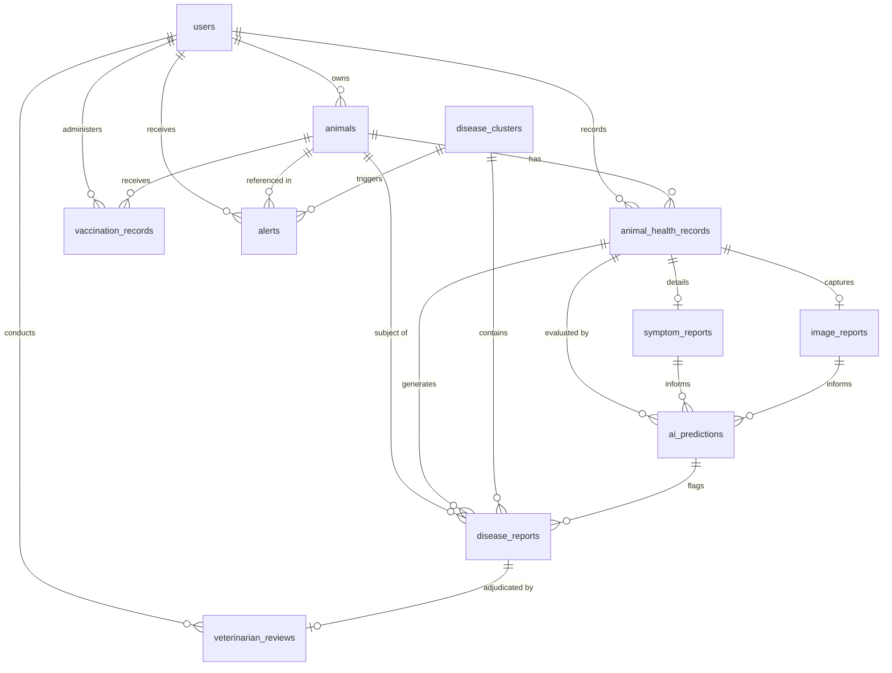

# AI-Livestock Health Sentinel: Database Architecture & Schema Documentation

**Project:** AI-Livestock Health Sentinel (SIH26128)  
**Database Engine:** PostgreSQL 16 with PostGIS 3.4 Spatial Extensions  
**ORM:** SQLAlchemy 2.0 (`backend/database_models.py`)  
**Migration Tool:** Alembic (`database/migrations/`)  
**DDL Reference:** [`database/schema.sql`](file:///C:/Users/Samruddhi%20Janwalkar/.gemini/antigravity/scratch/ai-livestock-health-sentinel/database/schema.sql)  
**Demo Seed Script:** [`database/seed_demo.sql`](file:///C:/Users/Samruddhi%20Janwalkar/.gemini/antigravity/scratch/ai-livestock-health-sentinel/database/seed_demo.sql)  
**Date:** September 2026  

---

## 1. Executive Summary & Core Architectural Principle

The **AI-Livestock Health Sentinel** database is built to handle mission-critical epidemic surveillance, individual livestock health passports, spatio-temporal outbreak tracking, and clinical triage.

### Mandatory Ethical & Clinical AI Separation Principle

> [!IMPORTANT]
> **AI Predictions Are Never Stored as Permanent Medical Truth.**  
> In veterinary medicine and epidemiology, automated artificial intelligence models (computer vision classifiers, tabular symptom models, and environmental risk calculators) produce **probabilistic estimates**, not definitive clinical diagnoses. 
> 
> To prevent clinical misclassification, premature quarantine enforcement, or legal liabilities, our database strictly separates three distinct tiers:
> 1. **`ai_predictions`:** Stores probabilistic model outputs, confidence scores, multi-class probabilities, SHAP symptom attributions, and a permanently locked `is_veterinary_diagnosis = FALSE` flag.
> 2. **`veterinarian_reviews`:** Stores independent human clinical triage conducted by a registered veterinary officer, including clinical findings, differential diagnoses, laboratory assays (e.g., PCR, ELISA), quarantine orders, and treatment plans.
> 3. **`animals.health_status` / `disease_reports.status`:** The confirmed ground-truth status of the livestock, updated **exclusively** upon veterinary adjudication or registered recovery. Raw AI model inferences never overwrite these fields automatically.

---

## 2. Entity-Relationship (ER) Diagram



---

## 3. Data Dictionary: All 11 Core Tables

### 3.1. `users` (Authentication & Role-Based Access Control)
Manages farmers, registered veterinarians, and district animal husbandry officers.

| Column | Type | Constraints | Description |
|---|---|---|---|
| `id` | UUID / VARCHAR(36) | PRIMARY KEY | Unique user identifier |
| `username` | VARCHAR(50) | UNIQUE, NOT NULL | Login username |
| `password_hash` | VARCHAR(255) | NOT NULL | Salted PBKDF2/bcrypt hash |
| `fullname` | VARCHAR(100) | NOT NULL | Full legal name |
| `role` | ENUM | NOT NULL | One of: `FARMER`, `VETERINARIAN`, `ADMIN` |
| `phone` | VARCHAR(20) | NULLABLE | Primary mobile number for SMS alerts |
| `district` | VARCHAR(50) | NULLABLE | Administrative district |
| `taluka` | VARCHAR(50) | NULLABLE | Sub-district / Taluka |
| `village` | VARCHAR(50) | NULLABLE | Village / Gram Panchayat |
| `license_number` | VARCHAR(50) | NULLABLE | State Veterinary Council registration number |
| `is_active` | BOOLEAN | NOT NULL, DEFAULT TRUE | Account state |
| `created_at` | TIMESTAMPTZ | NOT NULL | Timestamp of registration |
| `updated_at` | TIMESTAMPTZ | NOT NULL | Timestamp of last modification |

---

### 3.2. `animals` (Digital Animal Passport & Identification)
Tracks registered livestock with tamper-resistant ear-tag numbers and cryptographic QR codes.

| Column | Type | Constraints | Description |
|---|---|---|---|
| `id` | UUID / VARCHAR(36) | PRIMARY KEY | Internal system primary key |
| `animal_id` | VARCHAR(50) | UNIQUE, NOT NULL | Human-readable ear-tag identifier (e.g. `TAG-MH-2026-0041`) |
| `qr_code_identifier` | VARCHAR(100) | UNIQUE, NOT NULL | Cryptographic QR payload token for field paravet scanning |
| `species` | VARCHAR(30) | NOT NULL, DEFAULT 'Cattle' | Animal species (`Cattle`, `Buffalo`, `Sheep`, `Goat`) |
| `breed` | VARCHAR(50) | NOT NULL | Breed name (e.g. `Gir`, `Sahiwal`, `Murrah`) |
| `age` | NUMERIC(4, 1) | NOT NULL, CHECK (0-35) | Age in years |
| `gender` | ENUM | NOT NULL | `Female` or `Male` |
| `owner_id` | UUID / VARCHAR(36) | NOT NULL, FK -> `users.id` | Farmer/Owner reference (CASCADE) |
| **`health_status`** | **ENUM** | **NOT NULL, DEFAULT 'HEALTHY'** | **Ground truth status:** `HEALTHY`, `SUSPECTED`, `CONFIRMED_SICK`, `UNDER_TREATMENT`, `RECOVERED`, `DECEASED` |
| `latitude`, `longitude`| NUMERIC(9, 6) | NULLABLE | Home geolocation coordinates |
| `village`, `taluka`, `district` | VARCHAR(50) | NULLABLE | Administrative administrative hierarchy |
| `created_at` | TIMESTAMPTZ | NOT NULL | Registration date |

---

### 3.3. `animal_health_records` (Physiological Vitals & Clinical Encounters)
Stores time-series biometric checkups and vitals.

| Column | Type | Constraints | Description |
|---|---|---|---|
| `id` | UUID / VARCHAR(36) | PRIMARY KEY | Checkup record ID |
| `animal_id` | UUID / VARCHAR(36) | NOT NULL, FK -> `animals.id` | Animal reference (CASCADE) |
| `recorded_by_id` | UUID / VARCHAR(36) | NULLABLE, FK -> `users.id` | Paravet, farmer, or vet recorder |
| `body_temperature_c` | NUMERIC(4, 1) | NOT NULL, CHECK (34-44) | Rectal temperature in Celsius |
| `heart_rate_bpm` | INTEGER | NULLABLE | Beats per minute |
| `respiratory_rate_bpm` | INTEGER | NULLABLE | Breaths per minute |
| `appetite_score` | NUMERIC(2, 1) | NOT NULL, DEFAULT 1.0 | 0.0 (None), 1.0 (Normal), 2.0 (High) |
| `milk_yield_liters` | NUMERIC(4, 1) | NOT NULL, DEFAULT 0.0 | Daily milk production in liters |
| `activity_score` | NUMERIC(2, 1) | NOT NULL, DEFAULT 1.0 | 0.0 (Lethargic), 1.0 (Normal), 2.0 (High) |
| `rumination_hours` | NUMERIC(3, 1) | NULLABLE | Daily cud-chewing duration |
| `notes` | TEXT | NULLABLE | Field observations |
| `recorded_at` | TIMESTAMPTZ | NOT NULL | Observation timestamp |

---

### 3.4. `vaccination_records` (Immunization Tracking)
Maintains full immunization schedules for mandatory notifiable diseases.

| Column | Type | Constraints | Description |
|---|---|---|---|
| `id` | UUID / VARCHAR(36) | PRIMARY KEY | Record ID |
| `animal_id` | UUID / VARCHAR(36) | NOT NULL, FK -> `animals.id` | Animal reference (CASCADE) |
| `vaccine_name` | VARCHAR(100) | NOT NULL | e.g., "Lumpy Skin Disease Homologous Neethling", "FMD Oil Adjuvant" |
| `batch_number` | VARCHAR(50) | NULLABLE | Manufacturer batch number |
| `administered_date` | DATE | NOT NULL | Dose date |
| `next_due_date` | DATE | NOT NULL, INDEXED | Scheduled booster date |
| `administered_by_id`| UUID / VARCHAR(36) | NULLABLE, FK -> `users.id` | Paravet/Vet who administered dose |
| `status` | ENUM | NOT NULL | `ADMINISTERED`, `SCHEDULED`, `OVERDUE`, `EXEMPTED` |
| `certificate_url` | VARCHAR(255) | NULLABLE | Digital vaccination certificate URL |

---

### 3.5. `symptom_reports` (Clinical Symptom Ingestion)
Records farmer/paravet symptom checklists associated with a health checkup.

| Column | Type | Constraints | Description |
|---|---|---|---|
| `id` | UUID / VARCHAR(36) | PRIMARY KEY | Report ID |
| `health_record_id` | UUID / VARCHAR(36) | UNIQUE, NOT NULL, FK | Checkup encounter reference (CASCADE) |
| `reported_by_id` | UUID / VARCHAR(36) | NULLABLE, FK -> `users.id` | Reporter reference |
| `symptoms` | JSONB | NOT NULL | Array of active symptoms (e.g. `["skin_abnormalities", "fever"]`) |
| `onset_days_ago` | INTEGER | NOT NULL, DEFAULT 1 | Duration of symptom presentation |
| `severity_level` | ENUM | NOT NULL, DEFAULT 'MILD' | `MILD`, `MODERATE`, `SEVERE` |
| `clinical_notes` | TEXT | NULLABLE | Farmer descriptive notes |
| `reported_at` | TIMESTAMPTZ | NOT NULL | Timestamp |

---

### 3.6. `image_reports` (Dermatological & Lesion Photography)
Stores photograph metadata, image hashes, and edge image-quality validation results.

| Column | Type | Constraints | Description |
|---|---|---|---|
| `id` | UUID / VARCHAR(36) | PRIMARY KEY | Report ID |
| `health_record_id` | UUID / VARCHAR(36) | UNIQUE, NOT NULL, FK | Checkup encounter reference (CASCADE) |
| `uploaded_by_id` | UUID / VARCHAR(36) | NULLABLE, FK -> `users.id` | Uploader reference |
| `image_url` | VARCHAR(500) | NOT NULL | Stored cloud / local asset path |
| `image_hash_sha256` | VARCHAR(64) | NULLABLE | SHA-256 content digest for deduplication |
| `body_part` | VARCHAR(50) | NOT NULL, DEFAULT 'Full Body' | `Full Body`, `Flank/Hide`, `Muzzle/Mouth`, `Hooves/Feet`, `Udder` |
| `quality_check_passed` | BOOLEAN | NOT NULL, DEFAULT TRUE | Laplacian blur & brightness threshold check |
| `blur_laplacian_var`| NUMERIC(8, 2) | NULLABLE | Variance of Laplacian blur metric |
| `brightness_score` | NUMERIC(5, 2) | NULLABLE | Mean pixel luminosity (0-255) |

---

### 3.7. `ai_predictions` (Probabilistic Machine Learning Inferences)
Holds autonomous AI screening results with disclaimers and model attributions.

| Column | Type | Constraints | Description |
|---|---|---|---|
| `id` | UUID / VARCHAR(36) | PRIMARY KEY | Prediction ID |
| `health_record_id` | UUID / VARCHAR(36) | NOT NULL, FK | Evaluated health checkup (CASCADE) |
| `symptom_report_id` | UUID / VARCHAR(36) | NULLABLE, FK | Ingested symptom checklist reference |
| `image_report_id` | UUID / VARCHAR(36) | NULLABLE, FK | Ingested lesion photograph reference |
| `prediction_type` | ENUM | NOT NULL | `IMAGE_VISION`, `SYMPTOM_TABULAR`, `ENVIRONMENTAL_RISK`, `MULTIMODAL_FUSION` |
| `predicted_condition`| VARCHAR(100) | NOT NULL | Predicted disease (e.g. `Possible Lumpy Skin Disease`) |
| `confidence_score` | NUMERIC(5, 4) | NOT NULL, CHECK (0-1) | Raw model probability ($0.0000 - 1.0000$) |
| `risk_level` | ENUM | NOT NULL | `LOW`, `MODERATE`, `HIGH` |
| `risk_score` | NUMERIC(5, 2) | NOT NULL, CHECK (0-100) | Calibrated risk index ($0.00 - 100.00$) |
| `all_class_probabilities` | JSONB | NOT NULL | Probabilities across all 6 differential classes |
| `contributing_symptoms` | JSONB | NULLABLE | SHAP TreeExplainer feature attributions |
| `model_version` | VARCHAR(50) | NOT NULL | Model identifier (e.g. `MobileNetV3-v1.0`, `XGBoost-Symptom-v1.0`) |
| **`is_veterinary_diagnosis`** | **BOOLEAN** | **NOT NULL, DEFAULT FALSE** | **Permanently locked to FALSE** |
| **`disclaimer`** | **TEXT** | **NOT NULL** | Mandatory non-diagnostic legal notice |

---

### 3.8. `disease_reports` (Case Tracking & Lifecycle Management)
Tracks suspected cases through triage, quarantine, and recovery.

| Column | Type | Constraints | Description |
|---|---|---|---|
| `id` | UUID / VARCHAR(36) | PRIMARY KEY | Case report ID |
| `animal_id` | UUID / VARCHAR(36) | NOT NULL, FK -> `animals.id` | Subject animal (CASCADE) |
| `health_record_id` | UUID / VARCHAR(36) | NOT NULL, FK | Associated checkup |
| `ai_prediction_id` | UUID / VARCHAR(36) | NULLABLE, FK | Triggering AI prediction |
| `reported_disease` | VARCHAR(100) | NOT NULL, INDEXED | Suspected disease name |
| `reporting_source` | ENUM | NOT NULL | `FARMER_SELF_REPORT`, `AI_SENTINEL_SCREENING`, `VETERINARIAN_FIELD_VISIT`, `COMMUNITY_PARAVET` |
| `latitude`, `longitude`| NUMERIC(9, 6) | NOT NULL | Incident coordinates for DBSCAN clustering |
| **`status`** | **ENUM** | **NOT NULL, DEFAULT 'PENDING_REVIEW'** | `PENDING_REVIEW`, `VERIFIED_POSITIVE`, `REJECTED_FALSE_ALARM`, `RESOLVED_RECOVERED` |
| `is_quarantine_required` | BOOLEAN | NOT NULL, DEFAULT FALSE | Quarantine flag |
| `cluster_id` | UUID / VARCHAR(36) | NULLABLE, FK -> `disease_clusters.id` | Associated spatial cluster |

---

### 3.9. `disease_clusters` (DBSCAN Spatiotemporal Outbreak Surveillance)
Stores active epidemic clusters detected by DBSCAN spatial clustering algorithms.

| Column | Type | Constraints | Description |
|---|---|---|---|
| `id` | UUID / VARCHAR(36) | PRIMARY KEY | Cluster ID |
| `cluster_code` | VARCHAR(50) | UNIQUE, NOT NULL | Code (e.g. `CLUSTER-MH-PUN-001`) |
| `disease_name` | VARCHAR(100) | NOT NULL | Epizootic agent (e.g. `Lumpy Skin Disease`) |
| `center_latitude`, `center_longitude` | NUMERIC(9, 6) | NOT NULL | Centroid of case coordinates |
| `radius_km` | NUMERIC(6, 2) | NOT NULL | Buffer radius in kilometers |
| `case_count` | INTEGER | NOT NULL, DEFAULT 1 | Total confirmed/suspected cases in cluster |
| `severity` | ENUM | NOT NULL, DEFAULT 'WARNING' | `WATCH`, `WARNING`, `EMERGENCY` |
| `status` | ENUM | NOT NULL, DEFAULT 'ACTIVE' | `ACTIVE`, `CONTAINED`, `DISSOLVED` |
| `district` | VARCHAR(50) | NULLABLE | Administrative district |
| `detected_at` | TIMESTAMPTZ | NOT NULL | Initial detection timestamp |
| `last_case_at` | TIMESTAMPTZ | NOT NULL | Most recent case timestamp |

---

### 3.10. `alerts` (Early Warning Dispatch System)
Stores targeted and broadcast alerts dispatched to farmers, vets, and administrators.

| Column | Type | Constraints | Description |
|---|---|---|---|
| `id` | UUID / VARCHAR(36) | PRIMARY KEY | Alert ID |
| `recipient_id` | UUID / VARCHAR(36) | NULLABLE, FK -> `users.id` | Recipient user ID (NULL indicates broadcast) |
| `alert_type` | ENUM | NOT NULL | `OUTBREAK_EARLY_WARNING`, `CLUSTER_PROXIMITY_ALERT`, `VACCINATION_OVERDUE`, `CASE_TRIAGE_REQUIRED`, `HIGH_RISK_SYMPTOM` |
| `severity` | ENUM | NOT NULL, DEFAULT 'INFO' | `INFO`, `MODERATE`, `CRITICAL` |
| `title` | VARCHAR(200) | NOT NULL | Notification headline |
| `message` | TEXT | NOT NULL | Detailed actionable body |
| `related_cluster_id`| UUID / VARCHAR(36) | NULLABLE, FK | Referenced cluster |
| `related_animal_id` | UUID / VARCHAR(36) | NULLABLE, FK | Referenced livestock |
| `is_read` | BOOLEAN | NOT NULL, DEFAULT FALSE | Read receipt |

---

### 3.11. `veterinarian_reviews` (Independent Human Clinical Adjudication)
Authoritative clinical review and legal prescription by registered veterinary doctors.

| Column | Type | Constraints | Description |
|---|---|---|---|
| `id` | UUID / VARCHAR(36) | PRIMARY KEY | Review ID |
| `disease_report_id` | UUID / VARCHAR(36) | UNIQUE, NOT NULL, FK | Reviewed case report (CASCADE) |
| `veterinarian_id` | UUID / VARCHAR(36) | NOT NULL, FK -> `users.id` | Reviewing licensed veterinarian (RESTRICT) |
| **`review_decision`**| **ENUM** | **NOT NULL** | `CONFIRMED_POSITIVE`, `RULED_OUT_NEGATIVE`, `INCONCLUSIVE_RETEST`, `DIFFERENTIAL_DIAGNOSIS` |
| `clinical_diagnosis`| VARCHAR(100) | NOT NULL | Authoritative clinical diagnosis string |
| `laboratory_test_type` | VARCHAR(100) | NULLABLE | `PCR Skin Biopsy`, `ELISA`, `Bacterial Culture`, `None / Clinical Only` |
| `laboratory_result` | VARCHAR(50) | NULLABLE | `POSITIVE`, `NEGATIVE`, `INCONCLUSIVE`, `PENDING` |
| `treatment_plan` | TEXT | NULLABLE | Prescribed clinical regimen |
| `prescribed_medications` | TEXT | NULLABLE | Therapeutic drugs and dosages |
| `quarantine_order_issued` | BOOLEAN | NOT NULL, DEFAULT FALSE | Legal quarantine directive |
| `quarantine_duration_days` | INTEGER | NOT NULL, DEFAULT 0 | Mandatory isolation duration |
| `revisit_date` | DATE | NULLABLE | Follow-up checkup date |
| `clinical_notes` | TEXT | NULLABLE | Professional notes |
| `reviewed_at` | TIMESTAMPTZ | NOT NULL | Timestamp of review |

---

## 4. Database Migrations & Deployment

### Running Migrations via Alembic
```bash
# Upgrade database to latest schema
alembic upgrade head

# Rollback one migration step
alembic downgrade -1

# Generate SQL script offline without active connection
alembic upgrade head --sql
```

### Direct PostgreSQL DDL Execution
```bash
# Apply raw production schema
psql -U postgres -d livestock_sentinel -f database/schema.sql

# Seed initial demonstration data
psql -U postgres -d livestock_sentinel -f database/seed_demo.sql
```
