# Comprehensive Dataset Analysis: AI-Livestock Health Sentinel

**Project:** AI-Livestock Health Sentinel (SIH26128)  
**Date of Analysis:** September 2026  
**Scope:** In-depth individual inspection of all 7 raw datasets, feature distributions, data leakage vectors, clinical suitability, and recommended machine learning integration.

---

## Executive Summary Table

| Dataset | Purpose | Samples | Labels | Recommended Model | Problems | Use in Final System |
|---|---|:---:|---|---|---|---|
| **01_LSD_vs_Healthy_Cattle_Images** | Whole-animal field visual screening for Lumpy Skin Disease | 936 images | Binary: `healthycows` (515), `lumpycows` (421) | MobileNetV3-Small / ResNet-18 (Transfer Learning) | Low resolution (mean 275×185 px), 4 palette mode images, potential background pasture vs stall bias | Primary image classifier for farmer mobile whole-animal photo screening |
| **02_FMD_Cattle_Image_Detection** | Object detection & localization of Foot-and-Mouth Disease lesions | 80 images (81 bboxes) | Object class: `foot and mougth` (lesions on mouth/hooves) | YOLOv8n / YOLOv11n or Faster R-CNN (Few-Shot) | Very small sample size (80 images total: 56 train, 16 val, 8 test), risk of overfitting | Secondary visual screening & bounding-box lesion verification in Vet review queue |
| **03_LSD_Environmental_Geospatial_Data** | Environmental & bioclimatic vector breeding risk for LSD | 24,803 rows | Binary: `lumpy` (3,039 presence, 21,764 absence) | LightGBM / XGBoost with Spatial K-Fold | **Severe target leakage** in `region`, `country`, `reportingDate` (100% correlated with positive label); 7.16:1 class imbalance | Powers the Geospatial & Environmental Risk Engine (vector transmission multiplier) |
| **04_LSD_vs_Normal_Skin_Images** | Close-up bovine hide dermoscopic lesion classification | 1,024 images | Binary: `Normal Skin` (700), `Lumpy Skin` (324) | EfficientNet-B0 / MobileNetV3 with weighted cross-entropy | 2.16:1 class imbalance, 13 RGBA images requiring alpha channel strip | Close-up cutaneous nodule scanner & OpenCV lesion contour validation |
| **05_Cattle_Health_Feeding_Records** | Tabular symptom-to-disease diagnostic prediction | 43,778 rows | 5 diseases: `anthrax`, `blackleg`, `foot and mouth`, `pneumonia`, `lumpy virus` | Random Forest / XGBoost with multi-hot symptom encoding | Temperature recorded in Fahrenheit (needs °C conversion), symptom slot order dependency | Powers the symptom-based clinical assessment engine for cows and buffaloes |
| **06_Cattle_Disease_and_Health_Records** | Comprehensive multi-disease detection & milk yield regression | 250,000 rows (CSV 1: 40 cols, CSV 2: 37 cols) | CSV 1: 45 classes (`Healthy` 137k, 44 diseases ~2.5k each); CSV 2: Continuous `Milk_Yield_L` | CatBoost / LightGBM for classification; Isolation Forest for vitals anomaly detection | Class imbalance between healthy (55%) and individual diseases (~1% each); potential farm-level autocorrelation | **Core backbone dataset** for multi-disease risk assessment, physiological vitals anomaly detection, and Digital Health Passport |
| **07_Animal_Symptoms_Disease_Prediction** | Multi-species veterinary symptom-disease mapping | 431 rows | 139 disease classes across 8 animal species | Text Embedding / Rule-based clinical mapping | Severe class sparsity (~3 rows/disease), only 68 cattle rows, corrupted non-ASCII characters (`C`), duplicate rows | Used strictly as a clinical symptom ontology and vocabulary mapping reference |

---

## Detailed Individual Dataset Analyses

```
                                  DATASET ECOSYSTEM
┌────────────────────────────────────────────────────────────────────────────────────────┐
│                                 1. VISION TIER                                         │
│   01: Whole-Cow LSD vs Healthy (936 img)  │  04: Close-Up Hide Lesions (1,024 img)     │
│   02: FMD Lesion Object Detection (80 img, YOLO/COCO BBoxes)                           │
└───────────────────────────────────────────┬────────────────────────────────────────────┘
                                            │
┌───────────────────────────────────────────┴────────────────────────────────────────────┐
│                             2. TABULAR DIAGNOSTIC TIER                                 │
│   05: Multi-Disease Symptoms (43,778 rows: LSD, FMD, Pneumonia, Anthrax, Blackleg)     │
│   06: Global Cattle Telemetry (250,000 rows: 45 Diseases, Vitals, Vaccines, Yield)     │
│   07: Multi-Species Symptom Reference Dictionary (431 rows, 139 Disease Entities)      │
└───────────────────────────────────────────┬────────────────────────────────────────────┘
                                            │
┌───────────────────────────────────────────┴────────────────────────────────────────────┐
│                           3. GEOSPATIAL & SURVEILLANCE TIER                            │
│   03: LSD Bioclimatic Outbreak Coordinates (24,803 rows: Temp, Rain, Elevation, Herd) │
└────────────────────────────────────────────────────────────────────────────────────────┘
```

---

### Dataset 01: `01_LSD_vs_Healthy_Cattle_Images.zip`

#### 1. Files and Structure
- **Compressed Size:** 9.18 MB
- **Total Files:** 936 images across 2 class directories:
  - `healthycows/`: 515 images (`imgs001.jpg` to `imgs515.jpg`)
  - `lumpycows/`: 421 images (`imgs001.jpg` to `imgs421.jpg`)
- **Formats & Color Modes:** 932 RGB JPEGs, 4 Palette-mode (`P`) JPEGs.
- **Image Resolutions:**
  - Min: $153 \times 144$ pixels
  - Max: $350 \times 259$ pixels
  - Mean: $275.3 \times 184.8$ pixels
  - Predominant aspect ratios: $275 \times 183$ (146 files), $300 \times 168$ (112 files), $259 \times 194$ (87 files).

#### 2. Purpose
Binary image classification of cattle photographed under field conditions to distinguish healthy cows from cattle exhibiting visible physical signs of Lumpy Skin Disease (cutaneous nodules, emaciation, nasal discharge).

#### 3. Classes and Target Labels
- `0`: `healthycows` (Negative control)
- `1`: `lumpycows` (Positive disease presence)

#### 4. Tabular Columns
Not applicable (Unstructured image dataset).

#### 5. Sample Count per Class
- `healthycows`: 515 samples (55.02%)
- `lumpycows`: 421 samples (44.98%)
- **Total:** 936 samples

#### 6. Missing Values & Corruptions
- **Corrupted files:** 0 (all 936 images successfully decoded).
- **Format anomalies:** 4 images in `healthycows/` use an 8-bit palette color mode (`P`), requiring conversion to standard 3-channel RGB (`image.convert('RGB')`) during pre-processing.

#### 7. Duplicate Content
- **Content Hash Check (MD5):** 936 unique MD5 hashes. Zero identical duplicate image files detected.

#### 8. Class Imbalance
- Negligible imbalance ($\sim 1.22 : 1$). The dataset is well-balanced and does not require synthetic oversampling.

#### 9. Possible Data Leakage
- **Contextual Background Bias:** Healthy cattle images frequently feature outdoor green pasture backgrounds, while diseased cattle images are predominantly taken in confinement barns, dirt pens, or clinical examination chutes. Without aggressive background-invariance augmentations (random cropping, color jitter, CutMix), deep networks risk learning pasture greenery vs indoor barn lighting rather than clinical nodules.
- **Watermark & Logo Leakage:** Several images contain broadcast or agricultural agency text stamps in the corner, which must be cropped out or masked.

#### 10. Suitability for Proposed Features
- **Feature Fit:** Highly suitable for **Feature 3: Image-based Lumpy Skin Disease visual screening**.
- **Model Recommendation:** MobileNetV3-Small or ResNet-18 initialized with ImageNet pre-trained weights, fine-tuned with heavy affine and photometric augmentations.

---

### Dataset 02: `02_FMD_Cattle_Image_Detection.zip`

#### 1. Files and Structure
- **Compressed Size:** 3.95 MB
- **Total Files:** 85 files organized in standard Roboflow COCO export layout:
  - `train/`: 56 images + `_annotations.coco.json`
  - `valid/`: 16 images + `_annotations.coco.json`
  - `test/`: 8 images + `_annotations.coco.json`
  - Metadata: `README.dataset.txt`, `README.roboflow.txt` (License: CC BY 4.0)
- **Formats & Resolutions:** 80 RGB JPEG images. Resolutions range from $171 \times 194$ to $1600 \times 1600$ pixels (mean: $772.2 \times 947.0$ pixels). High-resolution smartphone macro shots of bovine muzzles, hooves, and oral cavities.

#### 2. Purpose
Object detection and spatial localization of acute **Foot-and-Mouth Disease (FMD)** lesions (oral ulcers, vesicles on the dental pad/tongue, and interdigital coronary band erosions).

#### 3. Classes and Target Labels
- Category ID 0: `cow-4tt4` (Context bounding box for animal muzzle/foot)
- Category ID 1: `foot and mougth` (Active disease lesion bounding box)

#### 4. Tabular Columns (COCO Annotation Schema)
- `images`: `id` (int), `file_name` (str), `width` (int), `height` (int)
- `annotations`: `id` (int), `image_id` (int), `category_id` (int: 0 or 1), `bbox` ($[x, y, w, h]$ in pixels), `area` (float), `iscrowd` (0)

#### 5. Sample Count per Class
- Total images: 80 (Train: 56, Valid: 16, Test: 8)
- Total bounding box annotations: 81
- Split annotation breakdown:
  - `train`: 57 annotations across 56 images
  - `valid`: 16 annotations across 16 images
  - `test`: 8 annotations across 8 images

#### 6. Missing Values & Corruptions
- 0 corrupted files. All 80 images and 3 COCO JSON annotation files are structurally sound.

#### 7. Duplicate Content
- 0 identical duplicate images.

#### 8. Class Imbalance
- Single target lesion class (`foot and mougth`). However, the overall sample size (80 images) represents extreme **data scarcity** for modern deep object detection models.

#### 9. Possible Data Leakage
- **Augmentation Leakage:** Roboflow exports often generate augmented variants from a smaller set of original images. If augmented variants of the same physical cow reside in both `train/` and `valid/` or `test/`, evaluation metrics will be overly optimistic.
- **Audit Requirement:** The MD5 hashes of base images must be clustered before final train/validation splitting.

#### 10. Suitability for Proposed Features
- **Feature Fit:** Essential for **Feature 9: Disease case reporting** and FMD clinical verification.
- **Model Recommendation:** Few-shot fine-tuned YOLOv8n or YOLOv11n with frozen backbone weights, or fine-tuning Faster R-CNN with Feature Pyramid Networks (FPN). Can also be converted to a binary patch classifier by cropping the bounding boxes.

---

### Dataset 03: `03_LSD_Environmental_Geospatial_Data.zip`

#### 1. Files and Structure
- **Compressed Size:** 0.66 MB (2.5 MB uncompressed)
- **Total Files:** 1 CSV file (`Lumpy skin disease data.csv`)
- **Shape:** 24,803 rows $\times$ 20 columns

#### 2. Purpose
Ecological niche modeling, species distribution modeling, and regional environmental vulnerability assessment for Lumpy Skin Disease outbreaks, incorporating bioclimatic indicators and livestock host densities.

#### 3. Classes and Target Labels
- Target: `lumpy` (binary integer: `0` or `1`)
  - `0`: Control pseudo-absence background location
  - `1`: Confirmed geo-referenced Lumpy Skin Disease outbreak event

#### 4. Tabular Columns
| Column Name | Data Type | Missing Count (%) | Description |
|---|---|:---:|---|
| `x` | `float64` | 0 (0.0%) | Geospatial Longitude (Decimal Degrees, EPSG:4326) |
| `y` | `float64` | 0 (0.0%) | Geospatial Latitude (Decimal Degrees, EPSG:4326) |
| `region` | `object` | 21,764 (87.8%) | Continental region (Asia: 777, Europe: 2172, Africa: 90) |
| `country` | `object` | 21,764 (87.8%) | Country name where outbreak occurred |
| `reportingDate` | `object` | 21,764 (87.8%) | Outbreak reporting date (YYYY-MM-DD) |
| `cld` | `float64` | 0 (0.0%) | Cloud cover percentage (%) |
| `dtr` | `float64` | 0 (0.0%) | Diurnal temperature range (°C) |
| `frs` | `float64` | 0 (0.0%) | Frost day frequency (days/month) |
| `pet` | `float64` | 0 (0.0%) | Potential evapotranspiration (mm/day) |
| `pre` | `float64` | 0 (0.0%) | Monthly precipitation (mm) |
| `tmn` | `float64` | 0 (0.0%) | Mean monthly minimum temperature (°C) |
| `tmp` | `float64` | 0 (0.0%) | Mean monthly temperature (°C) |
| `tmx` | `float64` | 0 (0.0%) | Mean monthly maximum temperature (°C) |
| `vap` | `float64` | 0 (0.0%) | Water vapor pressure (hectopascals / hPa) |
| `wet` | `float64` | 0 (0.0%) | Wet day frequency (days) |
| `elevation` | `int64` | 0 (0.0%) | Elevation above sea level (meters) |
| `dominant_land_cover` | `int64` | 0 (0.0%) | Land cover classification index (1 to 12) |
| `X5_Ct_2010_Da` | `float64` | 0 (0.0%) | Cattle population density (heads/$\text{km}^2$) |
| `X5_Bf_2010_Da` | `float64` | 0 (0.0%) | Buffalo population density (heads/$\text{km}^2$) |
| `lumpy` | `int64` | 0 (0.0%) | Binary target label (0 = absence, 1 = outbreak) |

#### 5. Sample Count per Class
- `0` (Absence / Background): 21,764 samples (87.75%)
- `1` (Presence / Outbreak): 3,039 samples (12.25%)
- **Total:** 24,803 samples

#### 6. Missing Values
- `region`, `country`, and `reportingDate` have exactly **21,764 missing values** (87.75%).
- All 15 environmental, climatic, geospatial, and host density features have **0 missing values**.

#### 7. Duplicate Content
- **0 duplicate rows** (100% unique geospatial-environmental coordinate pairs).

#### 8. Class Imbalance
- Severe class imbalance: $\sim 7.16 : 1$ ratio (87.8% absence vs 12.3% presence).
- Typical of Presence-Absence / Pseudo-Absence epidemiological datasets. Requires PR-AUC metric monitoring and `scale_pos_weight` weighting ($\sim 7.16$).

#### 9. Possible Data Leakage
- **CRITICAL LEAKAGE HAZARD:** `region`, `country`, and `reportingDate` are populated **only** when `lumpy == 1`. When `lumpy == 0`, these columns are null. Any machine learning model evaluated with these columns included will achieve 100% artificial accuracy by checking `reportingDate is not null`.
- **Mitigation:** `region`, `country`, and `reportingDate` **must be completely dropped** prior to model training.
- **Spatial Autocorrelation Leakage:** Outbreak presence points located within a few kilometers of each other share near-identical climate and density values. A standard random train/test split will leak spatially contiguous points into both partitions.
- **Mitigation:** Spatial Block Cross-Validation (Spatial K-Fold) must be enforced.

#### 10. Suitability for Proposed Features
- **Feature Fit:** **PERFECT MATCH** for **Feature 5: Environmental and geospatial LSD risk prediction** and **Feature 10: Geospatial disease surveillance map**.
- **Empirical Correlations with LSD Outbreaks:**
  - Precipitation (`pre`): $+0.4197$ (Strong positive: monsoon rain creates breeding sites)
  - Minimum Temperature (`tmn`): $+0.3086$ (Warm nights prevent vector larval mortality)
  - Mean Temperature (`tmp`): $+0.2834$
  - Cloud Cover (`cld`): $+0.2378$
  - Vapor Pressure (`vap`): $+0.1694$ (Humid air sustains flying insects)
  - Diurnal Range (`dtr`): $-0.2163$ (Extreme day-night temperature swings suppress vectors)
  - Frost Days (`frs`): $-0.1728$ (Freezing events eliminate biting flies)
  - Elevation (`elevation`): $-0.1124$ (Vectors decline at higher altitudes)
- **Model Recommendation:** LightGBM / XGBoost with geospatial coordinates and bioclimatic raster inputs.

---

### Dataset 04: `04_LSD_vs_Normal_Skin_Images.zip`

#### 1. Files and Structure
- **Compressed Size:** 154.25 MB
- **Total Files:** 1,024 images across 2 class directories:
  - `Normal Skin/`: 700 images (`Normal_Skin.png`, `Normal_Skin_1.png` to `_699.png`)
  - `Lumpy Skin/`: 324 images (`Lumpy_Skin.png`, `Lumpy_Skin_1.png` to `_323.png`)
- **Formats & Resolutions:** 1,024 PNG images, all precisely standardized to $256 \times 256$ pixels.
- **Color Channels:** 1,011 RGB images (3-channel), 13 RGBA images (4-channel).

#### 2. Purpose
Fine-grained visual inspection of cropped hide and dermatological skin patches to distinguish circumscribed nodular cutaneous lesions of Lumpy Skin Disease from healthy unblemished bovine skin.

#### 3. Classes and Target Labels
- `0`: `Normal Skin` (Healthy hide tissue)
- `1`: `Lumpy Skin` (Infected dermis exhibiting distinct circumscribed nodules and scabs)

#### 4. Tabular Columns
Not applicable (Image dataset).

#### 5. Sample Count per Class
- `Normal Skin`: 700 samples (68.36%)
- `Lumpy Skin`: 324 samples (31.64%)
- **Total:** 1,024 samples

#### 6. Missing Values & Corruptions
- 0 corrupted files (all 1,024 PNGs successfully loaded).
- 13 images contain an extraneous 4th alpha (transparency) channel (`RGBA`). Must be converted to 3-channel `RGB` via `.convert('RGB')` during DataLoader collation.

#### 7. Duplicate Content
- **0 content-identical duplicate images** (1,024 unique MD5 hashes).
- **Cross-Dataset Overlap:** Zero hash overlap with Dataset 01 (Dataset 01 contains whole animals, whereas Dataset 04 contains standardized skin crops).

#### 8. Class Imbalance
- Moderate imbalance: $2.16 : 1$ ratio (68.4% Normal vs 31.6% Lumpy).
- Managed easily via class-weighted cross-entropy loss ($\text{weight}_{\text{LSD}} \approx 2.16$) or Focal Loss.

#### 9. Possible Data Leakage
- **Patient/Animal Patch Leakage:** If multiple $256 \times 256$ crops were sampled from the same animal, splitting randomly at the patch level could place patches from the same cow into both training and validation sets. Models might memorize individual skin pigmentation rather than lesion topology.
- **Mitigation:** Use GroupKFold if animal identifiers are available, or apply heavy spatial transformations (rotation, shear, scaling) during evaluation.

#### 10. Suitability for Proposed Features
- **Feature Fit:** **IDEAL FIT** for **Feature 3: Image-based Lumpy Skin Disease visual screening** and computer vision contour validation.
- Standardized $256 \times 256$ square dimensions align with modern convolutional backbones.
- **Model Recommendation:** PyTorch MobileNetV3-Small or EfficientNet-B0 with Weighted Cross-Entropy or Focal Loss.

---

### Dataset 05: `05_Cattle_Health_Feeding_Records.zip`

#### 1. Files and Structure
- **Compressed Size:** 0.30 MB (2.5 MB uncompressed)
- **Total Files:** 1 CSV file (`animal_disease_dataset.csv`)
- **Shape:** 43,778 rows $\times$ 7 columns

#### 2. Purpose
Multi-class livestock disease classification based on animal type, age, rectal body temperature, and combinations of three reported clinical symptoms.

#### 3. Classes and Target Labels
- Target: `Disease` (5 classes):
  1. `anthrax`: 9,842 (22.48%)
  2. `blackleg`: 9,713 (22.19%)
  3. `foot and mouth`: 9,701 (22.16%)
  4. `pneumonia`: 7,330 (16.74%)
  5. `lumpy virus`: 7,192 (16.43%)

#### 4. Tabular Columns
| Column Name | Data Type | Missing Count | Unique Values | Description & Sample Values |
|---|---|:---:|:---:|---|
| `Animal` | `object` | 0 | 4 | Host species: `cow` (11,254), `buffalo` (11,238), `sheep` (10,658), `goat` (10,628) |
| `Age` | `int64` | 0 | 15 | Animal age in years ($1 - 15$) |
| `Temperature` | `float64` | 0 | 51 | Body temperature in **Fahrenheit** ($100.5^\circ\text{F} - 105.0^\circ\text{F}$) |
| `Symptom 1` | `object` | 0 | 24 | Primary symptom (e.g. `painless lumps`, `blisters on hooves`, `depression`) |
| `Symptom 2` | `object` | 0 | 24 | Secondary symptom (e.g. `loss of appetite`, `swelling in limb`, `sores on mouth`) |
| `Symptom 3` | `object` | 0 | 24 | Tertiary symptom (e.g. `crackling sound`, `shortness of breath`, `blisters on tongue`) |
| `Disease` | `object` | 0 | 5 | Target disease classification |

#### 5. Sample Count per Class
- Total across all animals: 43,778 rows
- Cattle-only subset (`cow` + `buffalo`): **22,492 rows**
  - `anthrax`: 4,957
  - `foot and mouth`: 4,873
  - `blackleg`: 4,889
  - `pneumonia`: 3,924
  - `lumpy virus`: 3,849

#### 6. Missing Values
- **0 missing values** across all 7 columns in all 43,778 rows.

#### 7. Duplicate Content
- **0 duplicate rows**.

#### 8. Class Imbalance
- Well-balanced: Each of the 5 diseases constitutes between 16.4% and 22.5% of the total dataset. No severe class imbalance.

#### 9. Possible Data Leakage & Clinical Discrepancies
- **Temperature Unit Mismatch:** The `Temperature` column records values between $100.5$ and $105.0$. These are in **Fahrenheit**, whereas Indian veterinary standards and our system use **Celsius** ($38.0^\circ\text{C} - 41.5^\circ\text{C}$).
  - *Conversion formula:* $T_{\text{Celsius}} = (T_{\text{Fahrenheit}} - 32) \times \frac{5}{9}$
- **Symptom Slot Order Dependency:** The 3 symptom columns (`Symptom 1`, `Symptom 2`, `Symptom 3`) draw from the same dictionary of 24 symptoms. Treating `Symptom 1` as a separate feature from `Symptom 2` introduces an artificial slot-order dependency.
  - *Mitigation:* Symptoms must be flattened into a multi-hot binary vector (e.g. `has_painless_lumps = 1`, `has_blisters_on_mouth = 1`).

#### 10. Suitability for Proposed Features
- **Feature Fit:** **DIRECT MATCH** for **Feature 4: Symptom-based multi-disease risk assessment**.
- Directly covers 3 core SIH problem diseases: Lumpy Skin Disease (`lumpy virus`), Foot and Mouth Disease (`foot and mouth`), and Bovine Respiratory Disease (`pneumonia`).
- **Model Recommendation:** Random Forest or Gradient Boosting with multi-hot symptom encoding and SHAP explainability.

---

### Dataset 06: `06_Cattle_Disease_and_Health_Records.zip`

#### 1. Files and Structure
- **Compressed Size:** 28.13 MB (~120 MB uncompressed)
- **Total Files:** 2 massive tabular CSV files:
  1. `global_cattle_disease_detection_dataset.csv` (250,000 rows $\times$ 40 columns)
  2. `global_cattle_milk_yield_prediction_dataset.csv` (250,000 rows $\times$ 37 columns)

#### 2. Purpose
- **File 1 (Disease Detection):** Large-scale epidemiological multi-disease detection and vital telemetry analysis covering 45 bovine health states across 40 worldwide cattle breeds, 15 countries, and 6 climate zones.
- **File 2 (Milk Yield Prediction):** Production regression modeling tracking milk yield variations influenced by parity, feed, lactation stage, and physiological health.

#### 3. Classes and Target Labels
- **File 1 Target:** `Disease_Status` (45 classes):
  - `Healthy`: 137,419 (54.97%)
  - 44 Disease classes: Each has between 2,419 and 2,687 samples ($\sim 1.05\%$ each).
  - Key target diseases included: `Lumpy_Skin_Disease` (2,576), `Foot_and_Mouth` (2,593), `Bovine_Respiratory_Disease` (2,590), `Pneumonia` (2,614), `Mastitis_Clinical` (2,552), `Mastitis_Subclinical` (2,466), `Brucellosis` (2,528), `Anthrax` (2,584), `Black_Quarter` (2,515), `Theileriosis` (2,555), `Babesiosis` (2,544), `Haemorrhagic_Septicemia` (2,521).
- **File 2 Target:** `Milk_Yield_L` (continuous variable: min 0.0, max 36.42, mean 8.72 L/day).

#### 4. Tabular Columns (File 1: 40 Columns)
- **Identifiers:** `Cattle_ID` (250,000 unique), `Farm_ID` (1,000 unique), `Date` (1,095 dates)
- **Demographics:** `Breed` (40 breeds, including Gir, Sahiwal, Tharparkar, Holstein-Friesian), `Age_Months` ($12 - 132$), `Weight_kg` ($250 - 750$), `Parity` ($1 - 6$), `Lactation_Stage` (Early, Mid, Late), `Days_in_Milk` ($1 - 365$), `Body_Condition_Score` ($2.0 - 5.0$)
- **Physiological Vitals:** `Body_Temperature_C` ($36.0^\circ\text{C} - 42.0^\circ\text{C}$), `Heart_Rate_bpm` ($40 - 120$), `Respiratory_Rate` ($15 - 55$), `Rumination_Time_hrs` ($2 - 14$), `Resting_Hours` ($6 - 16$)
- **Behavior & Management:** `Walking_Distance_km`, `Grazing_Duration_hrs`, `Milking_Interval_hrs` ($6, 8, 12, 24$), `Management_System` (Intensive, Semi-Intensive, Extensive, Pastoral, Mixed)
- **Nutrition:** `Feed_Type` (8 types), `Feed_Quantity_kg`, `Feeding_Frequency`, `Water_Intake_L`
- **Environment:** `Region`, `Country`, `Climate_Zone`, `Ambient_Temperature_C`, `Humidity_percent`, `Season`, `Housing_Score`
- **Vaccination History (8 binary flags):** `FMD_Vaccine`, `Brucellosis_Vaccine`, `HS_Vaccine`, `BQ_Vaccine`, `Anthrax_Vaccine`, `IBR_Vaccine`, `BVD_Vaccine`, `Rabies_Vaccine`
- **Production Telemetry:** `Milk_Yield_L`, `Previous_Week_Avg_Yield`
- **Target:** `Disease_Status` (45 classes)

#### 5. Sample Count per Class
- `Healthy`: 137,419 (54.97%)
- Diseased: 112,581 (45.03%) across 44 specific diseases.
- **Total:** 250,000 rows.

#### 6. Missing Values
- **0 missing values** across all 40 columns in all 250,000 rows.

#### 7. Duplicate Content
- **0 duplicate rows**. 250,000 unique `Cattle_ID` entries.

#### 8. Class Imbalance
- At the binary level (`Healthy` vs `Diseased`), the dataset is balanced (55% vs 45%).
- At the granular 45-class level, `Healthy` is the dominant majority class, while each of the 44 diseases is equally represented ($\sim 2,500$ samples each).

#### 9. Possible Data Leakage
- **Milk Yield Confounder:** Acute diseases cause a sudden drop in `Milk_Yield_L` relative to `Previous_Week_Avg_Yield` (mean yield is 10.37 L for healthy cows vs 6.49 L for sick cows, a 37.4% drop). If models rely solely on milk yield, they might fail to distinguish between different diseases.
- **Herd Autocorrelation:** The dataset contains 1,000 distinct farms (`Farm_ID`). A random train/test split will leak farm-specific feeding practices and ambient conditions across train and validation sets.
- **Mitigation:** GroupKFold on `Farm_ID`.

#### 10. Suitability for Proposed Features
- **Feature Fit:** **FOUNDATIONAL ANCHOR DATASET** for:
  - **Feature 1 & 2:** *Animal Registration & Digital Animal Health Passport* (provides realistic schema and demographics).
  - **Feature 4:** *Symptom-based multi-disease risk assessment* across 45 conditions.
  - **Feature 6:** *Multi-modal health risk scoring* (combines temperature, heart rate, rumination, milk yield, and vaccines).
  - **Feature 7 & 8:** *Health history tracking & Vaccination tracking*.
  - **Feature 16:** *IoT Vitals Telemetry Simulator* (`Body_Temperature_C`, `Heart_Rate_bpm`, `Rumination_Time_hrs`, `Walking_Distance_km`).
- **Model Recommendation:** LightGBM / CatBoost with Multi-Class Log-Loss for disease prediction; Isolation Forest for vitals anomaly detection.

---

### Dataset 07: `07_Animal_Symptoms_Disease_Prediction.zip`

#### 1. Files and Structure
- **Compressed Size:** 0.01 MB (45 KB uncompressed)
- **Total Files:** 1 CSV file (`cleaned_animal_disease_prediction.csv`)
- **Shape:** 431 rows $\times$ 22 columns

#### 2. Purpose
Multi-species symptom-to-disease clinical lookup covering 8 domesticated species (Dog, Cat, Cow, Horse, Sheep, Goat, Pig, Rabbit) and 139 disease conditions.

#### 3. Classes and Target Labels
- Target: `Disease_Prediction` (139 unique disease classes).

#### 4. Tabular Columns
- `Animal_Type` (8 species: Dog 75, Cat 72, Cow 68, Horse 66, Sheep 39, Goat 39, Pig 38, Rabbit 34)
- `Breed` (120 breeds)
- Demographics: `Age` ($1 - 16$), `Gender`, `Weight` ($4.5 - 600$ kg), `Duration` (days)
- Explicit Symptoms (Binary Yes/No): `Appetite_Loss`, `Vomiting`, `Diarrhea`, `Coughing`, `Labored_Breathing`, `Lameness`, `Skin_Lesions`, `Nasal_Discharge`, `Eye_Discharge`
- Symptom Categories: `Symptom_1`, `Symptom_2`, `Symptom_3`, `Symptom_4`
- Vitals: `Body_Temperature` (string with temperature and non-ASCII character `39.5C`), `Heart_Rate`
- Target: `Disease_Prediction` (139 classes)

#### 5. Sample Count per Class
- Total rows: 431 rows
- Bovine-only subset (`Cow`): **68 rows**
- Disease breakdown for cows: Bovine Tuberculosis (15), Bovine Respiratory Disease (14), Mastitis (5), Johne's Disease (5), Bovine Viral Diarrhea (4), FMD (2), Salmonellosis (2), etc.
- Average samples per class across all species: **3.1 samples**.

#### 6. Missing Values & Corruptions
- 0 empty cells, but **string character corruption** in `Body_Temperature`: degree symbol `°` was improperly decoded into replacement character `` (e.g. `'39.5C'`). Must be sanitized with regex `re.sub(r'[^\d.]', '', val)`.

#### 7. Duplicate Content
- **10 duplicate rows (2.32%)** detected.

#### 8. Class Imbalance & Sparsity
- **Extreme Class Sparsity:** 139 disease classes for 431 samples. Most diseases have only 1, 2, or 3 examples. Completely unsuitable for statistical classification.

#### 9. Possible Data Leakage
- Redundant feature encodings: Symptoms are listed both as categorical text in `Symptom_1` through `Symptom_4` and as binary flags (`Coughing = Yes`).
- Categorical inconsistencies: `Appetite Loss` vs `Loss of Appetite`, `Reduced Milk Production` vs `Decreased Milk Yield`.

#### 10. Suitability for Proposed Features
- **Feature Fit:** **NOT SUITABLE** as a standalone machine learning training dataset due to extreme sample sparsity and non-cattle dilution.
- **Strategic Value:** Highly valuable as a **Clinical Symptom Knowledge Base & Ontology Reference** to standardize user symptom inputs and build rule-based clinical validation logic (e.g., mapping `Skin_Lesions + Lameness -> FMD` or `Labored_Breathing + Fever -> BRD`).

---

## Strategic Dataset Mapping to the 16 System Features

```mermaid
graph TD
    D1["01: LSD Field Images"] --> F3["Feature 3: Visual LSD Screening"]
    D4["04: Normal vs LSD Skin"] --> F3
    D2["02: FMD Lesion BBoxes"] --> F9["Feature 9: Disease Case Reporting"]

    D5["05: Symptoms Dataset"] --> F4["Feature 4: Multi-Disease Assessment"]
    D6["06: Global Disease & Vitals"] --> F4
    D6 --> F6["Feature 6: Multi-Modal Health Scoring"]
    D6 --> F7["Feature 7: Health History Tracking"]
    D6 --> F8["Feature 8: Vaccination Tracking"]
    D6 --> F16["Feature 16: Vitals Telemetry Anomaly"]

    D3["03: LSD Environmental"] --> F5["Feature 5: Environmental LSD Risk"]
    D3 --> F10["Feature 10: Geospatial Surveillance Map"]
    D3 --> F11["Feature 11: Outbreak Cluster Detection"]

    D7["07: Symptom Dictionary"] --> F4
```



| System Feature | Primary Assigned Dataset | Secondary / Validation Dataset | Role in Final Architecture |
|---|---|---|---|
| **1. Animal Registration** | Dataset 06 (`global_cattle_disease_detection_dataset.csv`) | Dataset 05 | Provides standard schemas for 40 breeds, age ranges, weights, and identification tags |
| **2. Digital Health Passport** | Dataset 06 | Dataset 05 | Supplies historical vaccination schedules (FMD, Brucellosis, HS, BQ, Anthrax) and historical disease events |
| **3. Image-Based LSD Visual Screening** | Dataset 04 (`04_LSD_vs_Normal_Skin_Images.zip`) | Dataset 01 (`01_LSD_vs_Healthy_Cattle_Images.zip`) | Dual-stage vision: Dataset 04 for cropped hide lesion classification; Dataset 01 for full-body cattle screening |
| **4. Symptom-Based Multi-Disease Assessment** | Dataset 05 (`animal_disease_dataset.csv`) | Dataset 06 & Dataset 07 | Multi-disease classification across LSD, FMD, BRD, Anthrax, and Blackleg |
| **5. Environmental & Geospatial LSD Risk** | Dataset 03 (`03_LSD_Environmental_Geospatial_Data.zip`) | Dataset 06 (Ambient temp & humidity) | Quantifies vector-breeding potential based on rain, temperature, humidity, elevation, and cattle density |
| **6. Multi-Modal Health Risk Scoring** | Dataset 06 | Dataset 03, 04, 05 | Fuses visual score, symptom score, vitals anomaly score, and environmental score into a single 0-100 index |
| **7. Health History Tracking** | Dataset 06 | Dataset 05 | Establishes longitudinal health trajectory benchmarks |
| **8. Vaccination Tracking** | Dataset 06 | Dataset 05 | Tracks immunization status across 8 vaccines and predicts upcoming booster intervals |
| **9. Disease Case Reporting** | Dataset 02 (`02_FMD_Cattle_Image_Detection.zip`) | Dataset 05, 06 | Generates clinical verification cases with localized bounding boxes and symptoms |
| **10. Geospatial Disease Surveillance Map** | Dataset 03 | Dataset 06 | Supplies real-world geocoded coordinates for mapping case clusters and risk layers |
| **11. Outbreak Cluster Detection (DBSCAN)** | Dataset 03 | Dataset 06 | Provides spatio-temporal outbreak coordinates to benchmark DBSCAN epsilon and minPts parameters |
| **12. Early Warning Alerts** | Dataset 03 & Dataset 06 | Synthetic simulator | Triggers containment warnings when environmental risk and case density exceed thresholds |
| **13. Farmer Dashboard** | Dataset 06 | Dataset 05 | Powers herd status, production curves, and symptom checklists |
| **14. Veterinarian Dashboard** | Dataset 02 & Dataset 06 | Dataset 05 | Populates clinical review queue with triage vitals and lesion imagery |
| **15. Admin Dashboard** | Dataset 06 | Dataset 03 | Supplies system-wide epidemiological trends and ML performance metrics |
| **16. QR-Based Animal Identification** | Dataset 06 | Dataset 01, 04 | Embedded in animal dossiers linking tag IDs to health passports |
